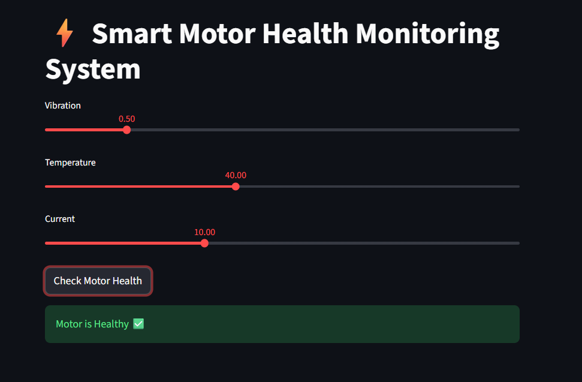
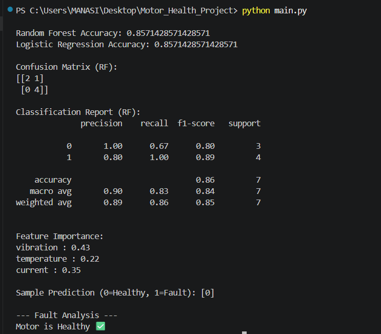
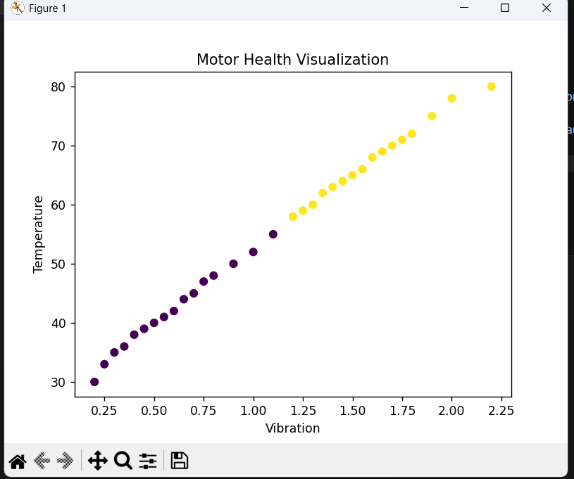

# ⚡ Smart Motor Health Monitoring System

## 📌 Overview
This project presents a Machine Learning-based predictive maintenance system for induction motors using key parameters like vibration, temperature, and current.

It helps detect faults early and improves system reliability.

---

## 🚀 Features
- 🔍 Fault detection (Healthy / Faulty)
- 📊 Data visualization
- 🤖 Machine Learning models (Random Forest, Logistic Regression)
- ⚡ Feature importance analysis
- 🌐 Interactive UI using Streamlit

---

## 🧠 Technologies Used
- Python
- Pandas, NumPy
- Scikit-learn
- Matplotlib
- Streamlit

---

## ⚙️ How to Run

### 1. Install dependencies

### 2. Run ML model

### 3. Run Web App

---

## 📊 Input Parameters
- Vibration
- Temperature
- Current

---

## 🎯 Output
- Motor health status (Healthy / Faulty)
- Fault type indication

---

## 🔧 Fault Types
- Bearing Fault (High vibration)
- Overheating / Stator Fault (High temperature)
- Overload Condition (High current)

---

## 📈 Future Scope
- Real-time sensor integration
- IoT-based monitoring
- Industrial deployment

---
## 📸 Project Demo

## 👨‍💻 Author
Mansi Shrikhande
